# L-Train Love — Product Architecture Diagrams

This document contains **copy-pasteable Mermaid diagrams** for the MVP architecture described in `docs/plan.md`.

> Tip: GitHub and many Markdown renderers support Mermaid natively. If yours doesn't, paste these into [mermaid.live](https://mermaid.live).

---

## 1) System Architecture (high level)

---

## 2) Data Model (tables + relationships)

Notes:
- `profiles.id` references `auth.users(id)` with `on delete cascade`.
- `check_ins.nickname` is intentionally denormalized (check-ins expire in 20 minutes, so stale nicknames are not a concern).
- Ephemeral behavior: filter `created_at > now() - 20m` in queries, never delete rows.

---

## 3) Auth Flow (sequence)

---

## 4) Realtime Channel Map

```mermaid
flowchart LR
  subgraph Tabs["App Tabs (inside AppShell)"]
    Lobby["Lobby Tab\n(station-lobby.tsx)"]
    Waves["Waves Tab\n(waves-view.tsx)"]
    Me["Me Tab\n(me-view.tsx)"]
  end

  subgraph RT["Supabase Realtime Subscriptions"]
    CI["postgres_changes:\npublic.check_ins INSERT\nRLS: open to all authed\n(client filters by station_id)"]
    SG["postgres_changes:\npublic.signals INSERT\nRLS: only to_user_id = auth.uid()\n(no client filter needed)"]
    PR["presence channel:\nstation:{station_id}\n(track user_id + nickname)"]
  end

  Lobby --> CI
  Lobby --> PR
  Waves --> SG
```

Key RLS implications:
- **check_ins**: RLS allows all authenticated users to `select`, so the client receives ALL new check-ins via realtime. Client must filter by `station_id === currentStation` and `created_at > now - 20m`.
- **signals**: RLS restricts `select` to `to_user_id = auth.uid()`, so the client ONLY receives waves addressed to the current user. No client-side filtering needed.

---

## 5) Sequence — App Boot (authenticated user)

---

## 6) Sequence — Create Check-in

---

## 7) Sequence — Presence

---

## 8) Sequence — Send Wave + Receive Wave

---

## 9) File / Component Dependency Graph

---

## 10) Deployment Architecture

---

## 11) Security Posture (MVP)

With **Supabase Auth + RLS**, the security model is:

| Table | select | insert | update | delete |
|-------|--------|--------|--------|--------|
| `profiles` | All authed users | Self only (`id = auth.uid()`) | Self only | Not allowed |
| `check_ins` | All authed users | Self only (`user_id = auth.uid()`) | Not allowed | Not allowed |
| `signals` | Self only (`to_user_id = auth.uid()`) | Self only (`from_user_id = auth.uid()`) | Not allowed | Not allowed |

**Practical MVP advice:**
- Start with these permissive-for-read policies. Test realtime with two browser windows before tightening.
- Keep `update`/`delete` disabled until after core flows work.
- For hackathon demo: consider disabling email confirmation in Supabase dashboard (Auth → Settings) to speed up the sign-up flow. Re-enable for production.
